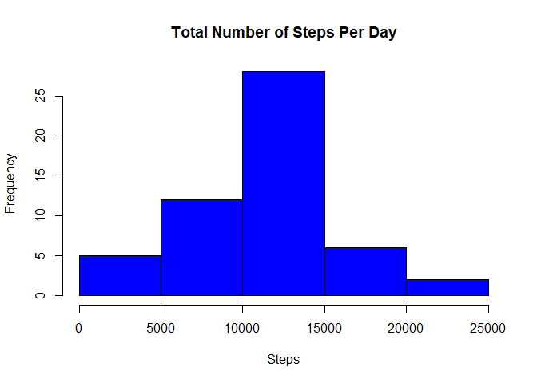
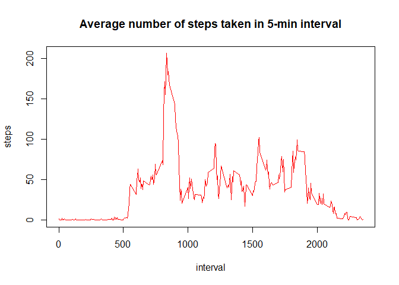
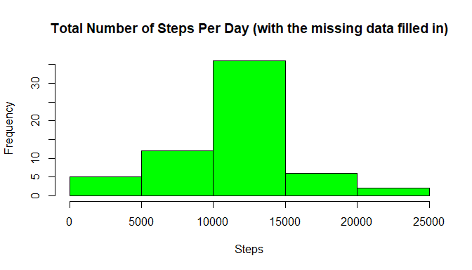
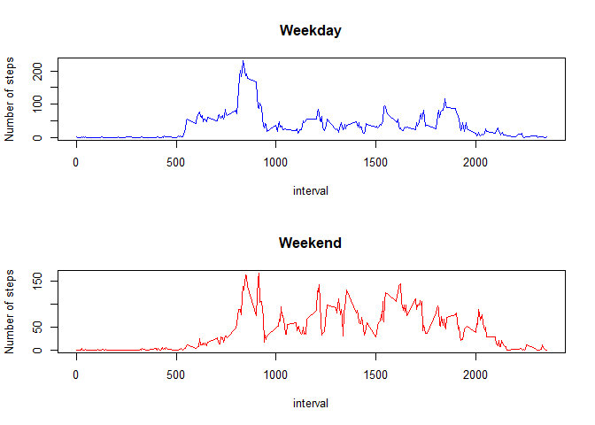

### Reproducible Research Project 1

It is now possible to collect a large amount of data about personal movement using activity monitoring devices such as a Fitbit, Nike Fuelband, or Jawbone Up. These type of devices are part of the “quantified self” movement – a group of enthusiasts who take measurements about themselves regularly to improve their health, to find patterns in their behavior, or because they are tech geeks. But these data remain under-utilized both because the raw data are hard to obtain and there is a lack of statistical methods and software for processing and interpreting the data.

This assignment makes use of data from a personal activity monitoring device. This device collects data at 5 minute intervals through out the day. The data consists of two months of data from an anonymous individual collected during the months of October and November, 2012 and include the number of steps taken in 5 minute intervals each day.

## Loading and preprocessing the data

The data set used has been provided by Coursera, which includes a myriad of data points related to walking activities. We will begin by reading in this data set, including the headers as the data is well formatted. 


```r
data <- read.csv("activity.csv", header=TRUE)
```

We will now obtain the number of steps taken on a daily basis. In order to do this, we will use the aggregate functiion to split and summarize the data and print the summarized results of the data returned by aggregate.


```r
stepsByDay <- aggregate(steps~date, data, sum)
head(stepsByDay)
```

```
##         date steps
## 1 2012-10-02   126
## 2 2012-10-03 11352
## 3 2012-10-04 12116
## 4 2012-10-05 13294
## 5 2012-10-06 15420
## 6 2012-10-07 11015
```

We will now calculate the initial mean and median step values based on stepsByDay and print these results. 


```r
mean1 <- mean(stepsByDay$steps)
median1 <- median(stepsByDay$steps)
mean1
```

```
## [1] 10766.19
```

```r
median1
```

```
## [1] 10765
```

To best represent the newly formed results visually, we shall now plot the number of daily steps using a historgram. 


```r
hist(stepsByDay$steps, col = "blue",xlab = "Steps", main = "Total Number of Steps Per Day")
```

<!-- -->

## Determining  the average daily activity pattern

We will now need to calculate the average number of stps taken per day using a 5-minute interval. In order to show this, we will use the aggregate function to calculate the means based on the steps and interval relationship and print the raw results of the aggregate call.


```r
averageSteps <- aggregate(steps~interval, data, mean)
head(averageSteps)
```

```
##   interval     steps
## 1        0 1.7169811
## 2        5 0.3396226
## 3       10 0.1320755
## 4       15 0.1509434
## 5       20 0.0754717
## 6       25 2.0943396
```

We will now use a time-series plot of all using all "types==1" in order to best represent the results. 


```r
with(averageSteps, plot(interval, steps ,type="l", main="Average number of steps taken in 5-min interval",col = "red")) 
```

<!-- -->

Using the current data frame, let's extract out the row data that contains the max average step in order to determine the related time interval. 


```r
averageSteps[which.max(averageSteps$steps),]
```

```
##     interval    steps
## 104      835 206.1698
```

## Imputing Missing Values

In the data set provided, there are a number of days and intervals where there are missing values. The presence of missing values can introduce bias into these calculations. We will need to address these issues in this section of the script. 

First we will calculate the total number of missing values (row-wise) from this data set. 


```r
sum(rowSums(is.na(data)))
```

```
## [1] 2304
```

For the missing data points, we will be using the daily mean to fill in these missing data points. We will do this by creating a new column our existing data set called "newSteps" using our averageSteps data frame information. 


```r
data$newSteps <- averageSteps$steps
```

We will now use the data from "averageSteps" to fill in any missing data set from our primary data frame


```r
data$steps <- ifelse(is.na(data$steps),data$newSteps,data$steps)
```

And the new data frame (head) summary looks like this and no NA values should exist. 

```r
head(data)
```

```
##       steps       date interval  newSteps
## 1 1.7169811 2012-10-01        0 1.7169811
## 2 0.3396226 2012-10-01        5 0.3396226
## 3 0.1320755 2012-10-01       10 0.1320755
## 4 0.1509434 2012-10-01       15 0.1509434
## 5 0.0754717 2012-10-01       20 0.0754717
## 6 2.0943396 2012-10-01       25 2.0943396
```

We will now create a brand new data frame using the original data set but with the missing fields filled in. The aggregate function is used to merge the missing data into the new data frame. 


```r
data$newSteps <- NULL
newdata <- data
sumdata <- aggregate(steps~date, newdata, sum)
```

We will now generate a histogram of the total number of steps taken each day and Calculate and report the mean and median total number of steps taken per day.


```r
hist(sumdata$steps, col = "green" ,xlab = "Steps" ,main = "Total Number of Steps Per Day (with the missing data filled in)")
```

<!-- -->

## Determining the difference in activity patterns between weekdays and weekends

In this section of code, we will be exploring the weekday vs. weekend activity. In order to properly execute this segment of code, we will be using the timeDate library in order to perform day of week calculations. 


```r
library(timeDate)
```

In order to determine which rows are related to a weekday or weekend, we will need to create a new column. 


```r
newdata$Weekday <- isWeekday(newdata$date)
```

We will now calculate the mean and median values for weekend and weekday activities. 


```r
weekday <- subset(newdata, newdata$Weekday == "TRUE")
weekdayMean <- aggregate(steps ~ interval, data = weekday, mean)
head(weekdayMean)
```

```
##   interval      steps
## 1        0 2.25115304
## 2        5 0.44528302
## 3       10 0.17316562
## 4       15 0.19790356
## 5       20 0.09895178
## 6       25 1.59035639
```

```r
weekend <- subset(newdata, newdata$Weekday == "FALSE")
weekendMean <- aggregate(steps ~ interval, data = weekend, mean)
head(weekendMean)
```

```
##   interval       steps
## 1        0 0.214622642
## 2        5 0.042452830
## 3       10 0.016509434
## 4       15 0.018867925
## 5       20 0.009433962
## 6       25 3.511792453
```

Using a time-series based panel plot, we will plot the average number steps taken during the weekend vs. weekday using the 5-minute interval metric. 


```r
layout(matrix(c(1,1,2,2), 2, 2, byrow = TRUE))
plot(weekdayMean$interval, weekdayMean$steps ,xlab = "interval", ylab = "Number of steps" ,main ="Weekday", col ="blue", type="l") 
plot(weekendMean$interval, weekendMean$steps ,xlab = "interval", ylab = "Number of steps" ,main ="Weekend", col ="red", type="l")
```

<!-- -->
